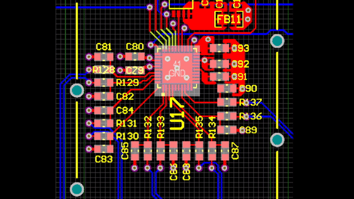
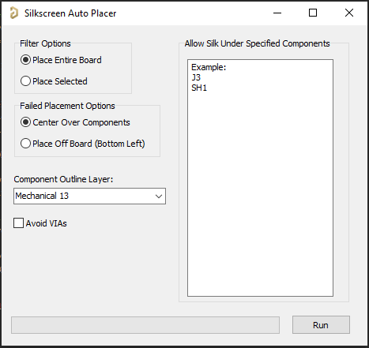

# Auto Place Silkscreen
Iterates through each components' silkscreen reference designator and tries to place it. It will not place over pads, component bodies, or other silkscreen. It will also not place off the board edge. The silkscreen size and width are automatically adjusted depending on the component size. If it can't find a placement, it will try reducing the size. I generally see ~95% placement on boards that aren't dense and ~80% placement on really dense boards (x86).

This script should be a good start for placement, but fine tuning will definitely need to be done after running.

## How to Run
1. Run script from pcb layout. If you want to only place selected components' silkscreen, then select these components (not designators) before running the script.
2. A GUI will open. Select options and run.
2. Any unplaced silkscreen will be placed on top of components by default or may be placed off the board if selected.
3. A popup message box will appear on completion saying how many components were placed and what percentage were placed.

Note: May take a long time to run depending on board size, board density, & speed of computer. It took my PC 15 seconds to place 230 components and about 15 minutes to place 3000 components on a much more dense board. My PC is relatively fast, so your mileage may vary. I would recommend trying to run on selected components first and select a smaller subset to see functionality.

## Performance & Placement Improvements
- **Obstacle caching**: obstacles (pads, tracks, arcs, vias, component bodies, other silkscreen) near each component are collected once with a single set of spatial queries. Every candidate position is then tested with pure in-memory rectangle math instead of creating up to 5 spatial iterators per candidate. This is the main speedup on large boards.
- **Base-position reuse**: the designator is only physically moved once per autoposition/size/rotation; the x/y offset grid is tested by translating the cached rectangle, not by moving the text.
- Trial moves no longer generate undo records (`BeginModify`/`EndModify`); only the final accepted position is committed properly.
- Messages panel and progress bar updates are throttled (every 10 components) instead of every component.
- **Smallest components first**: parts in dense clusters have the fewest viable spots, so they now get first pick of the free space.
- **Wider retry pass**: designators that fail the first pass are retried with a rotation flip (squarish components) and then with a wider offset grid (up to ±40 mil).
- **Non-rectangular boards**: candidate positions are checked against the actual board outline polygon (corner `PointInPolygon` tests), not just its bounding rectangle.
- Arcs on the overlay layer are now treated as obstacles (silkscreen outlines drawn with arcs were previously ignored).
- Bug fixes: rotation-retry pass measured the text aspect ratio instead of the component's (making it a near no-op); its placements were later overwritten by the failed-placement handling; the placed count included an uninitialized value; the rotation strategy selected in the GUI/ini was never applied.

## Things to try in future
- Can I use clearance rules? IPCB_SilkToSilkClearanceRule
- Iterate through all good placement positions, use the one with the lowest x/y --> x2/y2 delta square distance. This will slow down execution time.
- Only allow 2 silk designators close to eachother if they are perpendicular to eachother

## Potential Issues
- I've currently only tested on a couple of boards and it works well, but issues may crop up once I've expanded testing.
- Board outline is only approximated as a Bounding Rectangle. Non rectangular boards will probably have issues.

### Useful Links
- Zoom help: https://www.altium.com/documentation/18.0/display/ADES/PCB_Cmd-Zoom((Zoom))_AD
- Unit conversion functions and more: https://techdocs.altium.com/display/SCRT/PCB+API+Constants+and+Functions#General%20Functions